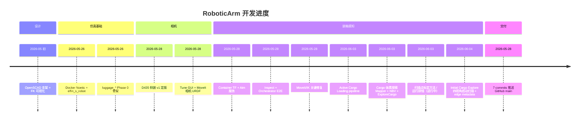
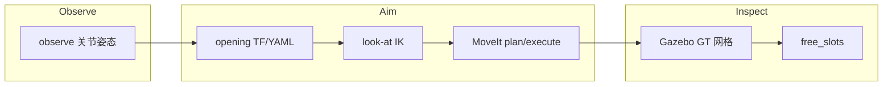
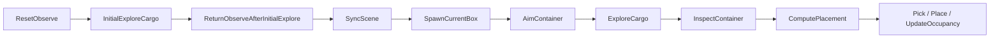

# 项目成果总结与 Timeline

Elfin S20 + RealSense D435 + 机场行李装箱仿真（ROS Noetic）。  
仓库：[github.com/adamliaoyifan/RoboticArm](https://github.com/adamliaoyifan/RoboticArm)

**当前状态（2026-06-04）**：Active Cargo Loading + Cargo 体素探索已落地；新增启动时 Initial Cargo Explore（`look_up/down/left/right` 四视角扫描、融合后回 `observe`）。Cargo 空间主表达为 3D 体素 occupancy grid，Cargo edge 以几何先验 + depth-observed edge metadata 输出。

---

## Timeline 总览



---

## 详细 Timeline

### T0 · 机械设计与可视化（2026-05 初）

| 项 | 内容 |
|---|---|
| **目标** | 评估 EOF 侧装 RealSense 的可行性与几何关系 |
| **交付** | `camera_mount.scad`（可打印支架）、`visualize_robot.py`（Plotly FK） |
| **Git** | `8a6a9a8` feat(design) |

---

### T1 · 仿真基础设施（2026-05-26）

| 项 | 内容 |
|---|---|
| **目标** | 在 Ubuntu 22.04 宿主机用 Docker 跑 Noetic Gazebo + MoveIt |
| **交付** | `docker/noetic/run.sh`；`elfin_noetic_ws/Dockerfile`；vendor [`elfin_s_robot`](elfin_noetic_ws/src/elfin_s_robot/) |
| **备注** | 修复 `elfin_ethercat_driver` 无效 `system_lib` CMake 警告 |
| **Git** | `a4e147d` infra · `14f6e31` vendor |

---

### T2 · 行李装箱工作空间骨架 Phase 0（2026-05-26）

| 项 | 内容 |
|---|---|
| **目标** | 模块化 ROS 栈：感知 / 规划 / 编排 / Gazebo 场景 |
| **包** | `luggage_msgs` · `luggage_description` · `luggage_gazebo` · `luggage_planning` · `luggage_perception` · `luggage_packing` · `luggage_bringup` |
| **能力** | Orchestrator 状态机、`sim_skeleton.launch`、检测/打包/路径 stub |
| **Git** | `e84de05` feat(luggage) |

---

### T3 · RealSense D435 安装外参 v1（2026-05-28）

| 项 | 内容 |
|---|---|
| **目标** | 生产 URDF 固定安装位，与 Gazebo 仿真一致 |
| **外参 v1** | 父 link：`elfin_link6` |
| | xyz (m)：`[-0.017202, 0.129806, 0.101650]` |
| | rpy (rad)：`[π/2, -π/2, 0]`（侧装） |
| **配置** | [`camera_mount_origin.xacro`](elfin_noetic_ws/src/luggage_description/config/camera_mount_origin.xacro) |
| **URDF/SRDF** | `elfin_s20_with_camera.urdf.xacro` · `S20_with_camera.srdf` |
| **坐标约定** | `camera_link` +X=镜头；规划 EE=`camera_depth_optical_frame`（+Z=视线） |
| **Tune 流程** | 6-DOF Gazebo 调参链 · GUI Save · `mount_config_utils` tune↔fixed |
| **Launch** | `sim_full.launch` · `camera_mount_tune.launch` · `moveit_with_camera.launch` |
| **Git** | `ea5c5bb` feat(camera) |

---

### T4 · Container Aim + Inspect（2026-05-28）

| 项 | 内容 |
|---|---|
| **目标** | 从 observe 姿态微调臂，相机对准集装箱开口，检测箱内空余格位 |
| **配置** | [`container.yaml.example`](elfin_noetic_ws/src/luggage_description/config/container.yaml.example) |
| **TF** | `world → elfin_base_link → container_link → container_opening_frame`（[`container_tf_publisher.py`](elfin_noetic_ws/src/luggage_bringup/scripts/container_tf_publisher.py)） |
| **Aim 数学** | [`container_aim_utils.py`](elfin_noetic_ws/src/luggage_planning/scripts/container_aim_utils.py)：look-at、多 seed IK、min Δq |
| **服务** | `/motion_planner/aim_camera_at_container` · `/container_inspector/inspect_container` |
| **MoveIt** | EE=`camera_depth_optical_frame`；可选 `elfin_link6` XY 约束；三级规划回退 |
| **感知** | Phase1：Gazebo GT 网格占用 → `free_slots` |
| **编排** | `ResetObserve → SyncScene → AimContainer → InspectContainer → Detect → …` |
| **Launch** | `roslaunch luggage_bringup inspect_container.launch` |
| **Git** | `34383d2` feat(container) |

---

### T5 · 关键 Bug 修复与验证（2026-05-28）

| 问题 | 现象 | 修复 |
|---|---|---|
| MoveIt action 命名 | 120s 超时 `move_group not ready` | 默认 action 改为 `/move_group`（非 `/move_group/move_group`） |
| URDF 加载 | `Error document empty` / move_group 崩溃 | `moveit_with_camera.launch` 使用全局 `/robot_description`，不 shadow `/move_group/robot_description` |
| IK 误判 | `No IK solution` 但 pose 可达 | `set_joint_value_target` 成功返回 `None`，不能 `if not ok` |
| Scene sync | `'Pose' has no attribute header'` | `PlanningSceneInterface.add_box` 使用 `PoseStamped` |
| TF 链 | `elfin_base_link → container_opening_frame` 失败 | 发布 `world → elfin_base_link`（`base_in_world` z=0.1） |

**Docker 内验证结果**：

| 步骤 | 结果 |
|---|---|
| `execute: false` IK | `success: True`，6 关节角 |
| `execute: true` aim | `Reached container aim` |
| `inspect_container` | 3 free_slots，occupancy 0% |
| Orchestrator E2E | AimContainer → InspectContainer 通过 |

---

### T6 · 代码托管（2026-05-28）

| 项 | 内容 |
|---|---|
| **远程** | [github.com/adamliaoyifan/RoboticArm](https://github.com/adamliaoyifan/RoboticArm) |
| **分支** | `main`（7 commits，按进度拆分） |

```
0e1f64e chore: initialize repository with documentation and gitignore
8a6a9a8 feat(design): add EOF camera mount CAD and FK visualizer
a4e147d feat(infra): add Docker tooling for Noetic sim and ROS2 executor
14f6e31 feat(vendor): add Huayan Elfin S20 Noetic stack and workspace image
e84de05 feat(luggage): add airport luggage loading workspace skeleton
ea5c5bb feat(camera): add RealSense D435 mount v1 and MoveIt camera URDF
34383d2 feat(container): add container aim, inspect pipeline, and planning fixes
```

---

### T7 · Active Cargo Loading（2026-06-03）

| 项 | 内容 |
|---|---|
| **目标** | 固定 robot/Cargo/pickup source，相机先空手观察 Cargo，再根据当前箱子尺寸规划放置 |
| **配置** | `container.yaml.example` 增加 `pickup_source`；新增 `box_catalog.yaml.example` |
| **服务** | `/pickup_box_spawner/spawn_next_box` · `/pickup_box_spawner/get_current_box` · `/bin_packer/compute_placement` |
| **编排** | `SpawnCurrentBox → AimContainer → InspectContainer → ComputePlacement → PlanPick → ExecPick → PlanPlace → ExecPlace → UpdateOccupancy` |
| **占用更新** | place 成功后写入 `/luggage/container_inspection/placed_boxes`，并同步 MoveIt collision object |
| **Launch** | `roslaunch luggage_bringup active_loading.launch` |

---

### T8 · Cargo 体素探索架构（2026-06-03，已实现）

| 项 | 内容 |
|---|---|
| **目标** | 装箱前用 eye-in-hand 深度多视点融合箱内占用，再 `inspect` / placement |
| **Mapper** | [`cargo_volume_mapper.py`](elfin_noetic_ws/src/luggage_perception/scripts/cargo_volume_mapper.py) + `cargo_volume_mapper_node` — 订阅 `/camera/depth/points`，体素 unknown/free/occupied，**无 ROS topic 发布**（stats/frontier 走 service + rosparam） |
| **服务** | `reset_cargo_map` · `integrate_cargo_view` · `get_cargo_map_stats` |
| **Planner** | [`cargo_nbv_planner.py`](elfin_noetic_ws/src/luggage_planning/scripts/cargo_nbv_planner.py) + `cargo_exploration_planner_node` — `plan_next_cargo_view`（`initial_fixed_scan` / `fixed_scan` 顺序播放 / `nbv` 候选贪心） |
| **编排** | `AimContainer` 后插入 **`ExploreCargo`**：reset → 动臂 → settle → integrate → 直至 `unknown_threshold` 或 `max_views` → `InspectContainer` |
| **Inspector** | `inspect_mode:=fused` 读 mapper rosparam；`gazebo_gt` 保留作评估 |
| **配置** | [`exploration.yaml.example`](elfin_noetic_ws/src/luggage_description/config/exploration.yaml.example) — `initial_scan_poses` / `fixed_scan_poses`（look_up/down/left/right）、体素分辨率、NBV 权重 |
| **Edge** | `/luggage/cargo_map/edge_points` · `edge_boxes` · `observed_edge_points`（几何先验 + depth 验证，不污染内部 free/occupied 主图） |
| **RViz** | `/luggage/cargo_map/octomap` · `/luggage/cargo_map/markers`；`camera_view.launch` 联调 |
| **Launch** | `active_loading.launch` 默认 `run_initial_explore:=true`、`initial_exploration_mode:=initial_fixed_scan`、`exploration_mode:=fixed_scan`；`exploration_mode:=none` 可跳过每箱探索 |

**默认扫描关节初值**（rad，需在仿真中微调）：

| 名称 | 用途 |
|---|---|
| `look_up` | 启动扫描上视角 |
| `look_down` | 启动扫描下视角 |
| `look_left` | 启动扫描左视角 |
| `look_right` | 启动扫描右视角 |

---

### T9 · 今日调试会话：扫描点标定与 ROS 运行（2026-06-03）

| 主题 | 结论 / 做法 |
|---|---|
| **工作策略** | 先 **固定 4～5 个扫描关节角** 写入 `exploration.yaml`，再单独调重建；自动几何视点规划留作下一阶段 |
| **标定工具** | 调 observe / 扫描角：`roslaunch luggage_bringup pose_tune_moveit.launch`（Gazebo + MoveIt + RViz + GUI）；**不要**单独 `moveit_for_camera_tune.launch` |
| **手调重建闭环** | `start_orchestrator:=false exploration_mode:=none` 起栈 → 每点 `go_to_joint_values` → `reset`/`integrate_cargo_view` → `get_cargo_map_stats`（看 `unknown_ratio` 是否逐点下降） |
| **`moveit_for_camera_tune` 报错** | `Action client not connected: elfin_arm_controller/follow_joint_trajectory` = **只起了 MoveIt、未起 Gazebo 控制器**；该 launch 仅供 `camera_mount_tune.launch use_moveit:=true` 子 include（双 URDF：Gazebo tune + MoveIt `robot_description_moveit`） |
| **XmlRpc 刷屏** | `Connection refused` / `couldn't find source iterator` = **roscore 已死** 或终端连错 Master（多 `roslaunch`、关 Gazebo 后仍 `rosservice call`、容器 stop 后宿主机客户端重试）→ `pkill` 清场后 **单终端单 launch** |
| **`rosservice` YAML** | `go_to_joint_values` 须真实 6 关节名 + 6 个浮点数，勿用字面量 `[...]` |
| **长期方向** | 几何驱动视点（开口法向、进深采样、IK/碰撞过滤、路径排序）替代纯 YAML 关节表；Mapper 增加 RViz `MarkerArray` / 点云发布便于调参 |

**今日未完成（记入下一步）**：

- [ ] 在 Gazebo 中确认 4 个 `fixed_scan_poses` 均可 `go_to_joint_values` 且 depth 覆盖箱内
- [ ] 空箱下 4 点融合后 `unknown_ratio` 达标（目标阈值 0.15）
- [ ] Mapper vs Gazebo GT 体素 IoU

---

### T10 · Initial Cargo Explore（2026-06-04，已实现）

| 项 | 内容 |
|---|---|
| **目标** | 初始化时先用四个固定扫描姿态重建 Cargo 内部空间，再回 `observe`，随后进入正常 active loading |
| **扫描姿态** | `look_up` · `look_down` · `look_left` · `look_right`（写入 `exploration.yaml.example` 的 `initial_scan_poses` 和默认 `fixed_scan_poses`） |
| **规划模式** | `initial_fixed_scan`：按序执行四个视角，不因 `unknown_threshold` 提前结束 |
| **碰撞安全** | 仍通过 `/motion_planner/go_to_joint_values` → MoveIt plan/execute；不可达或碰撞时进入 `Idle` 并输出状态 |
| **编排** | `ResetObserve → InitialExploreCargo → ReturnObserveAfterInitialExplore → SyncScene → SpawnCurrentBox ...` |
| **3D Occupancy** | 主地图仍为 `CargoVolumeMapper` 体素 `UNKNOWN/FREE/OCCUPIED` |
| **Cargo Edge** | 新增 `/luggage/cargo_map/edge_points`、`edge_boxes`、`observed_edge_points`；几何先验用于边界，depth 观测用于验证 |
| **Launch** | `active_loading.launch run_initial_explore:=true initial_exploration_mode:=initial_fixed_scan`（默认开启） |

---

## 系统流程（当前能力）



**Active Loading + 探索（`active_loading.launch`）**：



---

## Cargo 主动探索（实现摘要）

详见 **T8**。编排参数：`exploration_mode` = `none` | `fixed_scan` | `nbv`；`inspect_mode` = `gazebo_gt` | `fused` | `depth`。

---

## 下一步（未做 / 待扩展）

- [x] Phase2 箱内感知：体素 mapper + 固定扫描轨迹（NBV 初版为候选贪心）
- [x] Initial Cargo Explore：启动四视角扫描、融合、回 `observe`
- [ ] **进行中**：仿真验证 `look_up/down/left/right` 是否全部 MoveIt 可达且 depth 覆盖箱内
- [ ] 空箱四视角融合后 `unknown_ratio` 达标（目标阈值 0.15）
- [x] Mapper RViz 可视化（OctoMap + MarkerArray，`camera_view.launch`）
- [ ] 几何驱动视点采样 + 路径排序（替代纯关节表）
- [ ] Mapper 与 Gazebo GT 的体素 IoU 定量评估
- [ ] Pick/Place 真实 MoveIt 轨迹（当前 waypoint 仍为目标 pose stub）
- [ ] 实机 EtherCAT + 相同 URDF 外参验证

---

## 相关文档

| 文件 | 用途 |
|---|---|
| [`README.md`](README.md) | 快速上手、Docker、launch 命令 |
| [`CHANGELOG.md`](CHANGELOG.md) | 按版本/日期的变更摘要 |
| [`elfin_noetic_ws/src/luggage_bringup/README.md`](elfin_noetic_ws/src/luggage_bringup/README.md) | Bringup 包细节 |
