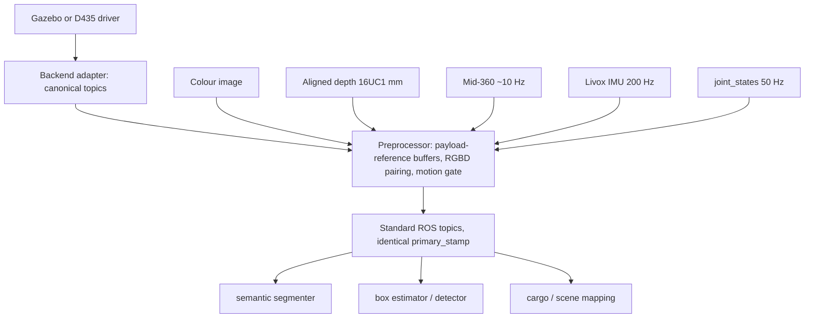

# Sensor data pipeline

Backend drivers and adapters may decode a **single** vendor stream into a
canonical ROS topic (Gazebo 32FC1 metres to D435-like 16UC1 millimetres is
the existing example). The preprocessor is the only place allowed to **pair**
streams, keep bounded history, correct frames, and score motion. Algorithm
nodes do not subscribe to raw multi-rate sensors.



## Canonical colour-aligned RGBD acquisition (PF-R9 g2)

The camera product is a **payload-identical RGBD set**. The preprocessor no
longer subscribes to, waits for, transforms, or publishes a camera point
cloud; `/luggage/preprocessed/camera/depth/points` is not a product.

One accepted acquisition contains:

1. colour image;
2. colour-aligned depth image in `16UC1` millimetres;
3. colour `CameraInfo`;
4. aligned-depth `CameraInfo` (its `K`/`P` describe the **colour** pixel
   grid);
5. preprocessor status.

The four image/calibration products of one acquisition share the exact
primary stamp, width, height, and a truthful colour optical frame. A stamp,
dimension, frame, or intrinsics mismatch rejects the whole acquisition and
produces no geometry (fail-closed, named reason counter). Aligned depth is
the **mandatory** pair gate: an acquisition without it is not emitted.

Backend bindings are configuration, never algorithm constants:

| Backend | Colour | Canonical depth | Optical frame |
|---|---|---|---|
| Gazebo | `/camera/color/image_raw` | `/camera/depth/image_raw` | configured common optical frame |
| D455 | `/camera/d455/color/image_raw` | `/camera/d555/aligned_depth_to_color/image_raw` | `d555_color_optical_frame` |

Native D455 depth and `/camera/d555/depth/color/points` are not legal
canonical inputs.

## Payload ownership and copy semantics (PF-R9 g2)

The ROS callback hands an **opaque immutable payload reference** (owning the
source `array.array('B')` / source message) to the ROS-free frame
structures. Rules:

- The preprocessor treats a received payload as immutable.
- `RgbFrame.copy()`, `DepthFrame.copy()`, and `SyncedObservation.copy()`
  share the payload reference; they never copy pixel bytes.
- Algorithm code receives read-only NumPy views built from read-only
  `memoryview`s (`np.frombuffer`); `view.setflags(write=True)` must fail.
- Only the ROS adapter/node layer may unwrap a payload for republish; the
  output `Image` rewrites header/metadata and assigns the original
  `array.array('B')` to `out.data`.
- The no-copy path covers receive -> view construction -> ring-buffer
  insertion -> pairing -> observation construction and copy-out -> emit
  queue -> output field assignment -> `Publisher.publish` call. No
  full-frame `copy`/`astype`/`ascontiguousarray`/`tobytes`/`bytes` on that
  path for a valid canonical input. DDS/CDR serialization may still copy;
  the pipeline is not claimed to be loaned-message or end-to-end
  zero-copy.
- Payload lifetime extends through `Publisher.publish()` return. Generated
  masks, instance maps, sparse results, and post-join working sets are new
  products outside this identity requirement.

`SyncedObservation` remains the preprocessor's **internal** copy-out object.
It is not a ROS message and not a cross-process API. The node publishes a
synchronised set of standard messages (`Image`, `CameraInfo`) plus a JSON
status string. The preprocessor does: view construction, buffering,
pairing, frame validation, motion gating, and payload-identical republish.
It does **not** run detection, RANSAC, planning, or point-cloud transport.
Single-stream adapters (depth metre-to-millimetre) stay upstream of it.

## Sensor registry

Frames, rates, and units as actually produced in this workspace. Trust this
table over message headers where the two disagree.

| Stream | Topic | Type | Header frame | Data really in | Rate | Units |
|---|---|---|---|---|---|---|
| Colour | `/camera/color/image_raw` | `Image` | `camera_depth_optical_frame` | optical | 30 Hz | RGB8 |
| Depth (gz native) | `/camera/depth/image_meters` | `Image` | `camera_depth_optical_frame` | optical | 30 Hz | 32FC1 metres, misses are `inf` |
| Depth (D435-like) | `/camera/depth/image_raw` | `Image` | `camera_depth_optical_frame` | optical | 30 Hz | 16UC1 millimetres |
| Camera info | `/camera/depth/camera_info` | `CameraInfo` | `camera_depth_optical_frame` | optical | 30 Hz | pixels |
| Camera points (legacy, unconsumed) | `/camera/depth/points` | `PointCloud2` | `camera_depth_optical_frame` (wrong) | **`camera_link`** (+X forward) | 30 Hz | metres, misses are `inf` |
| Cargo points | `/luggage/semantic/cargo_points` | `PointCloud2` | declared by producer | declared by producer | on demand | metres |
| Lidar | `/livox/lidar` | `PointCloud2` or Livox `CustomMsg` | `livox_frame` | sensor | ~10 Hz | metres, per-point time |
| Lidar IMU | `/livox/imu` | `Imu` | `livox_frame` | sensor | 200 Hz | gyro rad/s, **accel in g** |
| Joints | `/joint_states` | `JointState` | n/a | n/a | 50 Hz | rad |

Three traps encoded above:

1. **gz Fortress `rgbd_camera` is self-inconsistent.** Images and `camera_info`
   follow the optical convention and are labelled correctly, but `points` are
   published in the sensor (`camera_link`, +X forward) axes while carrying the
   optical `frame_id`. `gz_frame_id` relabels every topic at once, so it cannot
   be "fixed" in the xacro without breaking the image labels. This is the
   historical reason the transported camera cloud was removed from the
   pipeline (PF-R9 g2): the depth **image** streams are instead 100%
   exactly co-stamped with colour, and consumers deproject locally. Evidence:
   [m2_perception_occlusion_problem.md](../status/m2_perception_occlusion_problem.md).
2. **Far-plane misses arrive as `inf`, not NaN.** `read_points(skip_nans=True)`
   does not remove them and downstream RANSAC/PCA silently produces `nan`.
   Filter with `np.isfinite(pts).all(axis=1)`.
3. **Livox acceleration is in g**, while `sensor_msgs/Imu` is defined in m/s^2.
   Convert by 9.80665 at ingestion. Static z reading near 1.0 instead of 9.8
   means the conversion is missing.

Mid-360 URDF publishes `livox_frame` and `livox_imu_frame` (handbook
initial values in [mid360_origin.xacro](../../src/luggage_description/config/mid360_origin.xacro)).
Simulation publishes a Fortress `gpu_lidar` raster on `/livox/lidar` (no
per-point times, no `/livox/imu`). Real hardware still uses
`mid360.launch.py`. The preprocessor must not attach lidar to a snapshot
until deskew exists (`enable_lidar_output` stays false).

## Per-stream structures

Each sensor keeps its own timeline. Do not force different rates into one
"universal frame" struct at ingestion.

```python
RgbFrame:    stamp, frame_id, payload, view(), encoding
DepthFrame:  stamp, frame_id, payload, view(), units, encoding
LidarScan:   stamp_start, stamp_end, frame_id, points, point_times, imu_window
PoseSample:  stamp, joint_names, positions
```

Mandatory: every struct carries its own `stamp`. `RgbFrame`/`DepthFrame`
carry an **opaque immutable payload reference** plus a read-only view
constructor (§Payload ownership); they do not own writable pixel arrays.
`DepthFrame` carries `units` explicitly because both millimetre and metre
variants exist on this robot. `LidarScan` carries per-point times because a
scan is not an instant; see
[motion_compensation.md](motion_compensation.md).

## The snapshot (internal) and the published topic set

Pairing produces one immutable object **inside** the preprocessor:

```python
SyncedObservation:
    primary_stamp      # the clock this observation is dated by (RGB)
    primary_source     # "camera" | "lidar"
    rgb                # RgbFrame or None
    depth              # DepthFrame or None (aligned, mandatory gate)
    lidar_points       # ndarray or None, already compensated
    frame_id           # truthful colour optical frame of the acquisition
    lidar_dt           # abs(t_lidar - primary_stamp), seconds
    motion_score       # end-effector translation / rotation over the window
    flags              # rgb_ok, depth_ok, lidar_ok, deskewed,
                       # stale, motion_too_large, geometry_ok
```

The ROS node rewrites every accepted output header to `primary_stamp` and
publishes, assigning the **original source payloads** to the output `Image`
fields (no pixel materialisation):

| Topic | Type |
|---|---|
| `/luggage/preprocessed/camera/color/image` | `sensor_msgs/Image` |
| `/luggage/preprocessed/camera/color/camera_info` | `sensor_msgs/CameraInfo` |
| `/luggage/preprocessed/camera/depth/image` | `sensor_msgs/Image` |
| `/luggage/preprocessed/camera/depth/camera_info` | `sensor_msgs/CameraInfo` |
| `/luggage/preprocessed/status` | `std_msgs/String` (JSON) |

Rules:

- A missing stream is `None` plus a false flag. Never an empty array, never a
  zero-filled image. Silently substituting empty data turns a sensor dropout
  into a confident wrong answer. An acquisition without aligned depth is not
  emitted (mandatory pair gate, PF-R9 g2).
- Independent algorithm nodes subscribe to the subset of **preprocessed**
  topics they need. They must not subscribe to raw D435 / Mid-360 / joints
  in order to invent their own alignment.
- A single-input consumer may cache the latest preprocessed message and reject
  it by age against `primary_stamp`.
- A multi-input consumer may **exact-join** already synchronised outputs
  (identical stamps). Tolerance-based pairing belongs only in the preprocessor.
  Consumers retrieve the depth selected for an accepted acquisition by exact
  stamp; they never run a second nearest-neighbour search.

## Master clock and pairing

There is no single correct alignment policy, so the consumer picks the clock:

| Consumer | Primary source | Secondary handling |
|---|---|---|
| Pick detection (YOLO + box height) | camera | nearest lidar scan within the window, else `lidar_ok=false` |
| Container / cargo mapping | lidar | nearest RGB for colour only; geometry stays lidar |
| Anything during motion | neither | compensate first, or wait for settle |

Pick detection is **camera-triggered**. Box geometry comes from RGB-D; the
lidar is an optional enhancement. Requiring all three streams before emitting a
snapshot would throttle a 30 Hz detector down to the 10 Hz lidar, or starve it
completely when pairing fails.

A secondary stream may be attached only when both hold:

1. `abs(t_secondary - primary_stamp)` is inside the configured window, on the
   order of 30-50 ms for a wrist-mounted sensor;
2. `motion_score` over that interval is below threshold.

Otherwise the stream is dropped and flagged. The reason is geometric, not
philosophical: with the sensor on the flange, 50 ms of wrist rotation at a few
degrees displaces a point at 2 m by more than the detection tolerance. Static
extrinsics cannot repair that.

## Buffering

Camera acquisition buffers and every downstream exact-join buffer introduced
or touched by the PF-R9 g2 change are fixed at **15 entries / 1.0 second**
on the canonical camera stream clock:

- insertion by exact integer `(sec, nanosec)` stamp — payload identity is
  the integer stamp, never float equality;
- an identical stream/stamp replaces its index entry without occupancy
  growth;
- capacity eviction removes the oldest stamp first (`evicted_capacity`
  counter); horizon eviction removes entries older than
  `newest_camera_stamp - 1.0` (`evicted_horizon` counter);
- camera eviction uses the **camera clock only**: joint, IMU, lidar,
  wall-clock time, and a paused bag must not age camera payloads;
- index entries and copied frame wrappers share the original payload; they
  never duplicate its bytes. A 15-acquisition ceiling bounds payload bytes
  (23.0 MB at 640x480, 17.3 MB at 640x360) apart from a bounded tail held
  by in-flight callbacks and the four-deep emit queue.

**Rollback epoch**: a backward time jump beyond `rollback_sec` clears all
camera, accepted-acquisition, downstream exact-join, and pending-output
indexes, increments a local `camera_epoch`, and increments a rollback
counter. The epoch is a local reset/diagnostic domain; it does not cross
DDS because the standard image messages do not carry it. On rollback every
participating node clears its join buffers and pending output before
accepting the new timeline.

Other streams keep their own bounded rings:

| Stream | Retain | Reason |
|---|---|---|
| RGB / aligned depth / camera infos | 15 frames / 1.0 s | fixed PF-R9 g2 camera contract |
| Lidar scans | 2-4 scans (~200-400 ms) | one scan back plus margin |
| Lidar IMU | 0.5-1 s | attitude interpolation between joint samples |
| `joint_states` | 0.5-1 s | pose trajectory for per-point compensation |

Do not use `queue_size`/`depth` of 100 as a substitute for a ring buffer: it
delays rather than drops, and stale data then looks fresh.

Freshness is a snapshot property. Multi-sensor alignment is not re-implemented
per consumer. A single-input consumer may still reject a cached preprocessed
message that is older than its own deadline; that is an age check on
`primary_stamp`, not a second pairing loop.
