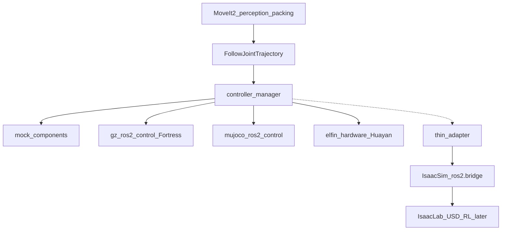

# ROS 2 simulation backends

Date: 2026-08-14  
Workspace: `elfin_humble_ws`  
Scope: how the Humble stack talks to Gazebo Fortress, MuJoCo, and Isaac Sim/Lab.  
Related: [ros2_humble_mvp_and_migration_plan.md](ros2_humble_mvp_and_migration_plan.md), [ros2_migration_todo.md](ros2_migration_todo.md), [gpu_runtime.md](../status/gpu_runtime.md)

Isaac Sim/Lab is research only in this batch. The host already has `/home/adamliao/isaacsim` 5.1; do not start Kit until Phase 7C.

## Architecture

The application layer (MoveIt 2, perception, packing, orchestrator) only uses:

- `robot_description` plus TF from `scene_tf.yaml`
- `FollowJointTrajectory`
- camera / point-cloud ROS 2 topics

Simulation and hardware are `ros2_control` `SystemInterface` plugins, or one thin adapter. Application code must not branch on `if gazebo` / `if isaac`.



Canonical assets (never overwrite from derived formats):

- S20 Xacro/STL: `robot_assets/elfin_description/`
- Suction / D435: `src/luggage_description/urdf/`
- Scene truth: `src/luggage_description/config/scene_tf.yaml`
- Container STL: `src/luggage_gazebo/models/airport_container_real/`

Derived: Fortress SDF, MuJoCo MJCF, Isaac USD.

GPU rendering is a hard gate for every interactive backend. See [gpu_runtime.md](../status/gpu_runtime.md).

## Gazebo Fortress and ROS 2

Humble official pairing is ROS 2 Humble ↔ Gazebo Fortress (`libignition-gazebo6` 6.18 on this host). Harmonic can be installed from OSRF packages but conflicts with `ros-humble-ros-gz*`. This repo defaults to Fortress.

On this host the CLI is `ign gazebo` (package `ignition-tools`). `gz sim` is Garden+ and is not on `PATH`. `ros2 launch ros_gz_sim gz_sim.launch.py gz_version:=6` invokes `ign gazebo`.

```bash
ign gazebo --versions    # 6.18.0
```

Communication:

- Control: URDF plugin `gz_ros2_control::GazeboSimSystem` drives the same `joint_trajectory_controller`.
- RGB-D: Fortress camera → `ros_gz_bridge` / `ros_gz_image` → `sensor_msgs`.
- Spawn/delete/state: `ros_gz` APIs. Do not keep Classic `/gazebo/spawn_sdf_model`.

GPU: Ogre2. Without NVIDIA passthrough the renderer falls back to `llvmpipe` and steals CPU from planning.

Role: **product closed-loop sim** (camera, box spawn, container collision, suction).

Installed on this host (Gate 0.5): `ros-humble-ros-gz`, `ros-humble-ros-gz-sim`, `ros-humble-gz-ros2-control`. Fortress here is `libignition-gazebo6` **6.18.0**. The CLI is `ign gazebo --versions` (Garden+ `gz sim` is not on this image). GUI smoke loaded `ignition-rendering-ogre2`; see [sim_smoke.md](../status/sim_smoke.md).

## MuJoCo and ROS 2

Package: `ros-humble-mujoco-ros2-control` (0.0.3 on this host). Plugin: `mujoco_ros2_control/MujocoSystemInterface`. Must use this package's `ros2_control_node`, not `controller_manager`'s, and remap `~/robot_description` → `/robot_description` on Humble.

Communication: the same `FollowJointTrajectory` action as mock and Fortress.

```bash
ros2 launch mujoco_ros2_control_demos 01_basic_robot.launch.py headless:=true
```

URDF→MJCF conversion is experimental. S20 + suction + container meshes need a hand-edited MJCF (actuators, geoms, mesh paths). Joint names must stay `elfin_joint1`–`elfin_joint6`.

Camera/lidar plugins exist, but D435-quality depth is weaker than Fortress/Isaac. Do not switch the perception primary path to MuJoCo unless that is measured.

GPU: Simulate window uses OpenGL (hard gate). Physics stays CPU. Do not mix `mjwarp` / Isaac physics in this phase.

Role: **control tracking and contact/stacking contrast backend**.

## Isaac Sim, Isaac Lab, and ROS 2

These are not the same product.

- **Isaac Sim** is the ROS 2 peer. Extension `isaacsim.ros2.bridge` publishes/subscribes `/clock`, TF, images, `joint_states` via OmniGraph. Official support: Humble and Jazzy. URDF imports to USD (`isaacsim.ros2.urdf` or file importer).
- **Isaac Lab** is a batched RL API on Sim. It is not a MoveIt closed-loop host. Reuse the same USD; train; then attach the policy to a ROS 2 node.

Gap: there is no official `SystemInterface` at the `gz_ros2_control` level. MoveIt needs a thin adapter (OmniGraph on `FollowJointTrajectory`, or `elfin_isaac_hardware`).

Process split: Isaac Sim 5.x/6.x uses Python 3.11 plus bundled Humble libs. This host's application stack is Python 3.10 `/opt/ros/humble`. Start Sim from a terminal that has **not** sourced Humble. Run `elfin_humble_ws` in another terminal. Custom `luggage_msgs` inside Sim may need a second build for 3.11.

GPU is mandatory. Lab batches can fill the 5090.

Role: photoreal RGB-D, synthetic data, later packing RL. Does not replace Phase 1–6. Gate 0.5 did not install Isaac. This host already has `/home/adamliao/isaacsim` 5.1.0-rc.19 with `isaacsim.ros2.bridge` Humble libs; Kit was not started. See [sim_smoke.md](../status/sim_smoke.md).

## URDF and container portability

Reusable:

- Joint names `elfin_joint1`–`elfin_joint6`, links, meshes, inertia, limits
- `scene_tf.yaml` chain: `world → pedestal_link / elfin_base_link / container_link → container_opening_frame`
- Opening corners, inner/outer extents
- Container visual/collision STL, pedestal and pickup sizes

Must convert:

- Fortress: SDF upgrade, gz camera instead of Classic RealSense plugins, spawn API
- MuJoCo: expanded URDF → MJCF + position actuators; container mesh geoms; suction via equality or an external attach service
- Isaac: USD Articulation + static collider; Isaac camera prims

Suction attach is the hardest port. Each backend implements it. The ROS 2 vacuum service name stays the same as hardware.

## Decision rules

Write changes here; do not change them verbally.

- Product closed-loop sim = Fortress + GPU
- Control / contact contrast = MuJoCo + GPU window
- GPU perception / synthetic data / RL = Isaac Sim, USD reused by Lab
- If Fortress GPU cameras or the control plugin fail on the 5090, re-evaluate Harmonic (package conflict risk) or Isaac as the primary sim

## References

- [Gazebo / ROS version matrix](https://gazebosim.org/docs/fortress/ros_installation/)
- [gz_ros2_control Humble](https://control.ros.org/humble/doc/gz_ros2_control/doc/index.html)
- [mujoco_ros2_control Humble](https://control.ros.org/humble/doc/mujoco_ros2_control/doc/index.html)
- [Isaac Sim ROS 2 bridge](https://docs.isaacsim.omniverse.nvidia.com/latest/installation/install_ros.html)
- [Isaac Sim ROS 2 putting it together](https://docs.isaacsim.omniverse.nvidia.com/latest/ros2_tutorials/tutorial_ros2_putting_it_all_together.html)
