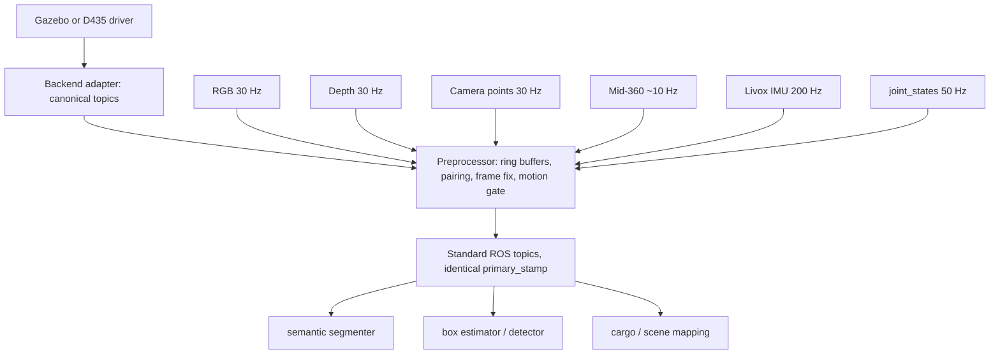

# Sensor data pipeline

Backend drivers and adapters may decode a **single** vendor stream into a
canonical ROS topic (Gazebo 32FC1 metres to D435-like 16UC1 millimetres is
the existing example). The preprocessor is the only place allowed to **pair**
streams, keep bounded history, correct frames, drop non-finite geometry, and
score motion. Algorithm nodes do not subscribe to raw multi-rate sensors.



`SyncedObservation` is the preprocessor's **internal** copy-out object. It is
not a ROS message and not a cross-process API. The node publishes a
synchronised set of standard messages (`Image`, `CameraInfo`, `PointCloud2`)
plus a JSON status string.

The preprocessor does: decode, unit normalisation, non-finite filtering,
buffering, pairing, frame correction, motion gating, and copy-out. It does
**not** run detection, RANSAC, or planning. Single-stream adapters (depth
metre-to-millimetre) stay upstream of it.

## Sensor registry

Frames, rates, and units as actually produced in this workspace. Trust this
table over message headers where the two disagree.

| Stream | Topic | Type | Header frame | Data really in | Rate | Units |
|---|---|---|---|---|---|---|
| Colour | `/camera/color/image_raw` | `Image` | `camera_depth_optical_frame` | optical | 30 Hz | RGB8 |
| Depth (gz native) | `/camera/depth/image_meters` | `Image` | `camera_depth_optical_frame` | optical | 30 Hz | 32FC1 metres, misses are `inf` |
| Depth (D435-like) | `/camera/depth/image_raw` | `Image` | `camera_depth_optical_frame` | optical | 30 Hz | 16UC1 millimetres |
| Camera info | `/camera/depth/camera_info` | `CameraInfo` | `camera_depth_optical_frame` | optical | 30 Hz | pixels |
| Camera points | `/camera/depth/points` | `PointCloud2` | `camera_depth_optical_frame` (wrong) | **`camera_link`** (+X forward) | 30 Hz | metres, misses are `inf` |
| Cargo points | `/luggage/semantic/cargo_points` | `PointCloud2` | declared by producer | declared by producer | on demand | metres |
| Lidar | `/livox/lidar` | `PointCloud2` or Livox `CustomMsg` | `livox_frame` | sensor | ~10 Hz | metres, per-point time |
| Lidar IMU | `/livox/imu` | `Imu` | `livox_frame` | sensor | 200 Hz | gyro rad/s, **accel in g** |
| Joints | `/joint_states` | `JointState` | n/a | n/a | 50 Hz | rad |

Three traps encoded above:

1. **gz Fortress `rgbd_camera` is self-inconsistent.** Images and `camera_info`
   follow the optical convention and are labelled correctly, but `points` are
   published in the sensor (`camera_link`, +X forward) axes while carrying the
   optical `frame_id`. `gz_frame_id` relabels every topic at once, so it cannot
   be "fixed" in the xacro without breaking the image labels. Consumers of
   points must take the data frame from a parameter. Evidence:
   [m2_perception_occlusion_problem.md](../status/m2_perception_occlusion_problem.md).
2. **Far-plane misses arrive as `inf`, not NaN.** `read_points(skip_nans=True)`
   does not remove them and downstream RANSAC/PCA silently produces `nan`.
   Filter with `np.isfinite(pts).all(axis=1)`.
3. **Livox acceleration is in g**, while `sensor_msgs/Imu` is defined in m/s^2.
   Convert by 9.80665 at ingestion. Static z reading near 1.0 instead of 9.8
   means the conversion is missing.

Mid-360 does not exist in simulation yet; `mid360_mount_frame` in
[eef_sensor_mount.urdf.xacro](../../src/luggage_description/urdf/eef_sensor_mount.urdf.xacro)
is a reserved empty link. Code must tolerate the lidar stream being absent.

## Per-stream structures

Each sensor keeps its own timeline. Do not force different rates into one
"universal frame" struct at ingestion.

```python
RgbFrame:    stamp, frame_id, image, camera_info
DepthFrame:  stamp, frame_id, depth, units, camera_info
CameraCloud: stamp, frame_id, data_frame, points
LidarScan:   stamp_start, stamp_end, frame_id, points, point_times, imu_window
PoseSample:  stamp, joint_names, positions
```

Mandatory: every struct carries its own `stamp`. `DepthFrame` carries `units`
explicitly because both millimetre and metre variants exist on this robot.
`CameraCloud` carries `data_frame` separately from `frame_id` because of trap 1.
`LidarScan` carries per-point times because a scan is not an instant; see
[motion_compensation.md](motion_compensation.md).

## The snapshot (internal) and the published topic set

Pairing produces one immutable object **inside** the preprocessor:

```python
SyncedObservation:
    primary_stamp      # the clock this observation is dated by (RGB)
    primary_source     # "camera" | "lidar"
    rgb                # RgbFrame or None
    depth              # DepthFrame or None
    camera_points      # ndarray or None, in the frame named below
    lidar_points       # ndarray or None, already compensated
    frame_id           # frame the 3D arrays are expressed in
    lidar_dt           # abs(t_lidar - primary_stamp), seconds
    motion_score       # end-effector translation / rotation over the window
    flags              # rgb_ok, depth_ok, lidar_ok, deskewed,
                       # stale, motion_too_large, geometry_ok
```

The ROS node rewrites every accepted output header to `primary_stamp` and
publishes:

| Topic | Type |
|---|---|
| `/luggage/preprocessed/camera/color/image` | `sensor_msgs/Image` |
| `/luggage/preprocessed/camera/color/camera_info` | `sensor_msgs/CameraInfo` |
| `/luggage/preprocessed/camera/depth/image` | `sensor_msgs/Image` |
| `/luggage/preprocessed/camera/depth/camera_info` | `sensor_msgs/CameraInfo` |
| `/luggage/preprocessed/camera/depth/points` | `sensor_msgs/PointCloud2` |
| `/luggage/preprocessed/status` | `std_msgs/String` (JSON) |

Rules:

- A missing stream is `None` plus a false flag. Never an empty array, never a
  zero-filled image. Silently substituting empty data turns a sensor dropout
  into a confident wrong answer. Do not republish raw clouds as cargo.
- `frame_id` on published clouds states where the 3D arrays actually are.
- Independent algorithm nodes subscribe to the subset of **preprocessed**
  topics they need. They must not subscribe to raw D435 / Mid-360 / joints
  in order to invent their own alignment.
- A single-input consumer may cache the latest preprocessed message and reject
  it by age against `primary_stamp`.
- A multi-input consumer may **exact-join** already synchronised outputs
  (identical stamps). Tolerance-based pairing belongs only in the preprocessor.

## Master clock and pairing

There is no single correct alignment policy, so the consumer picks the clock:

| Consumer | Primary source | Secondary handling |
|---|---|---|
| Pick detection (YOLO + box height) | camera | nearest lidar scan within the window, else `lidar_ok=false` |
| Container / cargo mapping | lidar | nearest RGB for colour only; geometry stays lidar |
| Anything during motion | neither | compensate first, or wait for settle |

Pick detection is **camera-triggered**. Box geometry comes from RGB-D; the
lidar is an optional enhancement. Requiring all three streams before emitting a
snapshot would throttle a 30 Hz detector down to the 10 Hz lidar, or starve it
completely when pairing fails.

A secondary stream may be attached only when both hold:

1. `abs(t_secondary - primary_stamp)` is inside the configured window, on the
   order of 30-50 ms for a wrist-mounted sensor;
2. `motion_score` over that interval is below threshold.

Otherwise the stream is dropped and flagged. The reason is geometric, not
philosophical: with the sensor on the flange, 50 ms of wrist rotation at a few
degrees displaces a point at 2 m by more than the detection tolerance. Static
extrinsics cannot repair that.

## Buffering

Sizing rule: slowest stream period times the pairing window, plus margin.
Buffers are bounded ring buffers with latest-wins eviction and stamp-based
pruning. An unbounded queue is a defect.

| Stream | Retain | Reason |
|---|---|---|
| RGB / depth / camera points | 5-10 frames (~150-300 ms) | enough to pair a ~10 Hz lidar; short enough that a grasp never uses a 1 s old image |
| Lidar scans | 2-4 scans (~200-400 ms) | one scan back plus margin |
| Lidar IMU | 0.5-1 s | attitude interpolation between joint samples |
| `joint_states` | 0.5-1 s | pose trajectory for per-point compensation |

Do not use `queue_size`/`depth` of 100 as a substitute for a ring buffer: it
delays rather than drops, and stale data then looks fresh.

Freshness is a snapshot property. Multi-sensor alignment is not re-implemented
per consumer. A single-input consumer may still reject a cached preprocessed
message that is older than its own deadline; that is an age check on
`primary_stamp`, not a second pairing loop.
